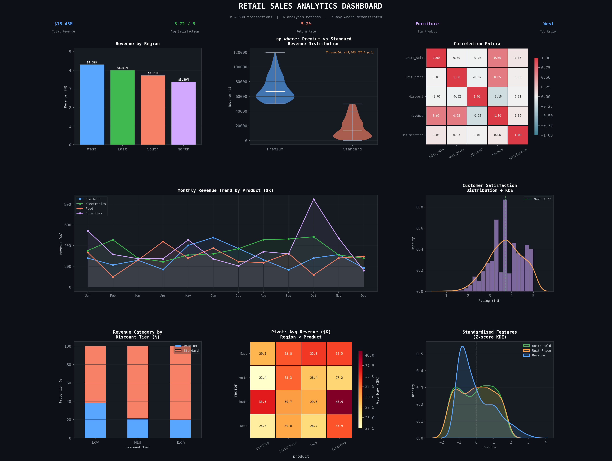

# 🛒 Retail Sales Analytics Dashboard PYTHON

A comprehensive data analysis and visualization project built with Python, demonstrating advanced pandas manipulation, NumPy operations, and Matplotlib/Seaborn dashboarding on a synthetic retail dataset of 500 transactions.

---

## 📊 Dashboard Preview



---

## 🚀 Features

- ✅ Synthetic dataset generation with realistic retail data (500 rows, 9 columns)
- ✅ 6 advanced analysis & manipulation methods
- ✅ NumPy array conversion + `np.where` demonstration
- ✅ 8-panel analytics dashboard with dark theme

---

## 🔬 Analysis Methods Used

| # | Method | Description |
|---|--------|-------------|
| 1 | **Descriptive Statistics** | `.describe()` on numerical columns |
| 2 | **GroupBy Aggregation** | Revenue sum/mean/count by Region × Product |
| 3 | **Correlation Matrix** | Pearson correlations between all numeric features |
| 4 | **Pivot Table** | Average revenue heatmap across Region × Product |
| 5 | **Feature Engineering** | Created `revenue_per_unit`, `high_value`, `season`, `discount_tier` |
| 6 | **StandardScaler (Z-score)** | Normalised features for ML-readiness |

---

## 🔢 NumPy Demonstration

```python
# Convert pandas column to NumPy array
revenue_np = df['revenue'].to_numpy()

# np.where — classify transactions at 75th percentile threshold
threshold   = np.percentile(revenue_np, 75)          # $49,899
revenue_cat = np.where(revenue_np >= threshold, 'Premium', 'Standard')
```

| Category | Count |
|----------|-------|
| Premium  | 125   |
| Standard | 375   |

---

## 📈 Dashboard Plots

| Plot | Type | Insight |
|------|------|---------|
| Revenue by Region | Bar Chart | West leads in total revenue |
| Premium vs Standard | Violin Plot | np.where classification result |
| Correlation Matrix | Heatmap | Units & price each drive ~0.65 of revenue |
| Monthly Trend | Multi-line Chart | Revenue patterns across 12 months by product |
| Satisfaction Distribution | Histogram + KDE | Mean rating: 3.72 / 5 |
| Discount Tier vs Category | Stacked Bar | High discounts reduce premium share |
| Avg Revenue Heatmap | Pivot Heatmap | South/Furniture = highest avg ($40,950) |
| Z-score KDE | Density Plot | Standardised feature distributions |

---

## 📦 Requirements

```bash
pip install pandas numpy matplotlib seaborn scikit-learn
```

---

## ▶️ How to Run

```bash
python Question_04.py
```

Output: `retail_dashboard.png` saved in the same directory.

---

## 📁 Project Structure

```
retail-sales-analytics/
│
├── Question_04.py          # Main analysis script
├── retail_dashboard.png    # Generated dashboard image
└── README.md               # Project documentation
```

---

## 📊 Key Metrics

| Metric | Value |
|--------|-------|
| Total Revenue | $15.45M |
| Avg Customer Satisfaction | 3.72 / 5 |
| Return Rate | 5.2% |
| Top Product | Furniture |
| Top Region | West |

---

## 🛠️ Tech Stack


---

## 👨‍💻 Author

**Mawiya** — [@mawiya-47](https://github.com/mawiya-47)
